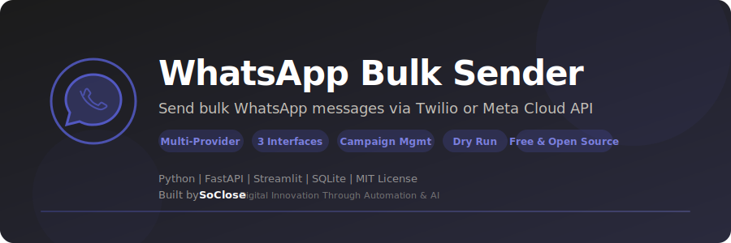

<p align="center">
  
</p>

<p align="center">
  <strong>Send bulk WhatsApp messages via Twilio or Meta Cloud API — CLI, Web Dashboard & Telegram Bot.</strong>
</p>

<p align="center">
  <a href="LICENSE"></a>
  <a href="https://www.python.org/downloads/"></a>
  
  
  <a href="https://github.com/SoCloseSociety/WhatsappSender/stargazers"></a>
  <a href="https://github.com/SoCloseSociety/WhatsappSender/issues"></a>
  <a href="https://github.com/SoCloseSociety/WhatsappSender/network/members"></a>
</p>

<p align="center">
  <a href="#quick-start">Quick Start</a> &bull;
  <a href="#key-features">Features</a> &bull;
  <a href="#configuration">Configuration</a> &bull;
  <a href="#faq">FAQ</a> &bull;
  <a href="#contributing">Contributing</a>
</p>

---

## What is WhatsApp Bulk Sender?

**WhatsApp Bulk Sender** is a free, open-source **WhatsApp automation tool** built with Python. It lets you send personalized WhatsApp messages to hundreds of contacts from a CSV file, using either **Twilio** or **Meta Cloud API** as the messaging provider.

The tool offers three interfaces: an interactive CLI, a Streamlit web dashboard, and a Telegram bot for remote administration. It handles CSV import, phone number normalization (E.164), campaign management, delivery tracking, and rate limiting out of the box.

### Who is this for?

- **Startup Founders** sending product updates to early adopters
- **E-commerce Sellers** notifying customers about orders and promotions
- **Community Managers** broadcasting messages to members
- **Marketing Teams** running WhatsApp outreach campaigns
- **Event Organizers** sending reminders and confirmations
- **Developers** building WhatsApp messaging integrations

### Key Features

- **Smart CSV Import** - Auto-detects columns from Shopify, WooCommerce, Google Contacts
- **Multi-Provider** - Twilio (sandbox free) or Meta Cloud API (business)
- **Dynamic Placeholders** - Personalize with {first_name}, {last_name}, {phone}
- **Reusable Templates** - Save and reuse message templates
- **Campaign Management** - Organize sends by campaign with delivery tracking
- **Delivery Tracking** - Real-time status: sent → delivered → read → failed
- **Rate Limiting** - Configurable message throttling to respect API limits
- **3 Interfaces** - CLI interactive, Web Dashboard (Streamlit), Telegram Bot
- **Dry Run Mode** - Test campaigns before sending real messages
- **E.164 Normalization** - Phone numbers normalized automatically
- **SQLite Database** - WAL mode for concurrency, zero config
- **Cross-Platform** - Works on Windows, macOS, and Linux
- **Free & Open Source** - MIT license

---

## Quick Start

### Prerequisites

| Requirement | Details |
|-------------|---------|
| **Python** | Version 3.11 or higher ([Download](https://www.python.org/downloads/)) |
| **Twilio Account** | Free sandbox available ([Sign up](https://www.twilio.com/)) |
| **or Meta Developer** | For production use ([Sign up](https://developers.facebook.com/)) |

### Installation

```bash
# 1. Clone the repository
git clone https://github.com/SoCloseSociety/WhatsappSender.git
cd WhatsappSender

# 2. (Recommended) Create a virtual environment
python -m venv venv

# Activate it:
# Windows:
venv\Scripts\activate
# macOS / Linux:
source venv/bin/activate

# 3. Install dependencies
pip install -r requirements.txt

# 4. Configure
cp .env.example .env
# Edit .env with your Twilio or Meta credentials
```

> **Detailed setup:** [SETUP_GUIDE.md](SETUP_GUIDE.md) — Step-by-step configuration for Twilio, Meta and Telegram

### Usage

#### CLI Mode (default)

```bash
python main.py
```

```
  ╔════════════════════════════════════════════╗
  ║   WhatsApp Bulk Sender — v1.0.0           ║
  ║     by SoClose Society                    ║
  ╚════════════════════════════════════════════╝

  1  Import contacts (CSV)
  2  View contacts
  3  Send messages
  4  Statistics
  5  Templates
  6  Send history
  7  Test a message
  8  Delete all contacts
  0  Quit
```

**Typical workflow:**
1. Place your `.csv` file in the project directory
2. Option `1`: Import contacts and create a campaign
3. Option `3`: Choose the campaign, compose the message, confirm
4. Option `4`: Check delivery stats

#### Web Dashboard (Streamlit)

```bash
python main.py --dashboard
```

Full web interface on `http://localhost:8501` with:
- CSV drag & drop import
- Real-time sending progress
- Visual statistics (charts)
- Template and contact management

#### Telegram Bot (remote administration)

```bash
python main.py --telegram
```

| Command | Description |
|---------|-------------|
| `/start` | Main menu with buttons |
| `/import` | Import a CSV (send the file) |
| `/send` | Choose a campaign and send |
| `/stats` | Sending statistics |
| `/contacts` | Contact list |
| `/templates` | View templates |
| `/cancel` | Cancel current operation |

#### Webhook Server

```bash
python main.py --webhook
```

FastAPI server for delivery callbacks. API docs at `http://localhost:8000/docs`.

---

## CSV Format

The CSV file must contain at minimum a **phone** column:

```csv
phone,first_name,last_name,email
+33612345678,Jean,Dupont,jean@email.com
+33687654321,Marie,Martin,marie@email.com
0612345678,Pierre,Durand,
```

**Auto-detected columns:**

| Internal | Accepted columns |
|----------|-----------------|
| `phone` | phone, telephone, tel, mobile, numero, billing phone |
| `first_name` | first_name, firstname, prenom, billing first name |
| `last_name` | last_name, lastname, nom, billing last name |
| `email` | email, e-mail, billing email |
| `name` | name, full_name, fullname (auto-split) |

> Compatible with Shopify, WooCommerce, Google Contacts, Mailchimp and any standard CSV.

---

## Configuration

### Provider Comparison

| | Twilio | Meta Cloud API |
|---|---|---|
| **Difficulty** | Easy (5 min) | Medium (15 min) |
| **Free sandbox** | Yes | No |
| **Price (marketing)** | ~$0.05/msg + markup | ~$0.05/msg |
| **Price (utility)** | ~$0.02/msg + markup | ~$0.02/msg |
| **Recommended for** | Testing & prototyping | Production & business |

### Environment Variables

```bash
# WhatsApp Provider (twilio or meta)
WA_PROVIDER=twilio

# Twilio
TWILIO_ACCOUNT_SID=ACxxxxxxxxxxxxxxxxxxxxxxxxxxxxxxxx
TWILIO_AUTH_TOKEN=your_auth_token
TWILIO_WHATSAPP_FROM=whatsapp:+14155238886

# Meta Cloud API
WA_PHONE_NUMBER_ID=123456789012345
WA_ACCESS_TOKEN=your_access_token
WA_API_VERSION=v21.0

# Telegram Bot (optional)
TELEGRAM_BOT_TOKEN=your_bot_token
TELEGRAM_ADMIN_IDS=123456789

# Rate limiting
WA_MESSAGES_PER_SECOND=50

# Dashboard
DASHBOARD_PASSWORD=your_password
```

> **Full configuration:** see [.env.example](.env.example) and [SETUP_GUIDE.md](SETUP_GUIDE.md)

---

## Architecture

```
WhatsappSender/
│
├── main.py                  # Entry point — CLI/Telegram/Dashboard/Webhook router
│
├── Interfaces
│   ├── cli.py               # Interactive CLI — import, send, stats
│   ├── telegram_bot.py      # Telegram bot — remote administration
│   ├── dashboard.py         # Streamlit web dashboard
│   └── webhook.py           # FastAPI server — delivery callbacks
│
├── Core
│   ├── whatsapp.py          # Multi-provider WhatsApp client (Twilio/Meta)
│   ├── csv_handler.py       # CSV import & phone normalization
│   ├── database.py          # SQLite async layer (WAL mode)
│   └── config.py            # Environment variable loading
│
├── Config
│   ├── .env.example         # Configuration template
│   ├── requirements.txt     # Python dependencies
│   └── .gitignore           # Excluded files
│
├── Docs
│   ├── README.md            # This file
│   ├── SETUP_GUIDE.md       # Detailed configuration guide
│   └── DEPLOYMENT.md        # VPS / Docker deployment
│
├── assets/
│   └── banner.svg           # Project banner
├── LICENSE                  # MIT License
└── CONTRIBUTING.md          # Contribution guidelines
```

---

## Deployment

```bash
# VPS — systemd service
python main.py --telegram    # Telegram bot + webhooks (production)

# Docker
docker build -t whatsapp-sender .
docker run -d --env-file .env -p 8000:8000 whatsapp-sender

# Docker Compose
docker compose up -d
```

> **Full guide:** [DEPLOYMENT.md](DEPLOYMENT.md) — Nginx, SSL, systemd, Docker Compose

---

## Troubleshooting

### Twilio sandbox not working

1. Make sure recipients have opted in by sending "join <sandbox-keyword>" to the Twilio number
2. Verify your `TWILIO_WHATSAPP_FROM` matches the sandbox number
3. Check Twilio console logs for error details

### Messages not delivering

1. Verify phone numbers are in E.164 format (+33612345678)
2. Check provider dashboard for error logs
3. Ensure rate limiting is configured properly

### Dashboard won't start

```bash
pip install --upgrade streamlit
streamlit run dashboard.py
```

### Import CSV fails

1. Ensure your CSV has a `phone` column (or recognized alternative)
2. Check CSV encoding (UTF-8 recommended)
3. Verify phone number format

---

## FAQ

**Q: Is this free?**
A: The tool is 100% free and open source. You only pay for the WhatsApp API provider (Twilio sandbox is free for testing).

**Q: Twilio or Meta — which should I use?**
A: Twilio for testing and prototyping (free sandbox). Meta Cloud API for production and business use.

**Q: How many messages can I send?**
A: Depends on your provider plan. Twilio free sandbox is limited. Meta Business has higher limits.

**Q: Can I personalize messages?**
A: Yes. Use placeholders like {first_name}, {last_name}, {phone} in your message templates.

**Q: Can I test without sending real messages?**
A: Yes. Use the Dry Run mode to simulate a campaign.

**Q: Does it work on Mac / Linux?**
A: Yes. Fully cross-platform on Windows, macOS, and Linux.

**Q: Can I manage it remotely?**
A: Yes. Use the Telegram bot interface for remote campaign management.

---

## Alternatives Comparison

| Feature | WhatsApp Bulk Sender | Manual Sending | Twilio Console | Paid SaaS Tools |
|---------|---------------------|----------------|----------------|----------------|
| Price | **Free** | Free | Pay-per-message | $50-300/mo |
| Bulk sending | Yes | No | Limited | Yes |
| CSV import | Yes (auto-detect) | N/A | No | Yes |
| Campaign tracking | Yes | Manual | Basic | Yes |
| Multiple interfaces | 3 (CLI, Web, Telegram) | N/A | Web only | Web only |
| Open source | Yes | N/A | No | No |
| Templates | Yes | N/A | Yes | Yes |
| Dry run | Yes | N/A | No | Varies |

---

## Contributing

Contributions are welcome! Please read the [Contributing Guide](CONTRIBUTING.md) before submitting a pull request.

---

## License

This project is licensed under the [MIT License](LICENSE).

---

## Disclaimer

This tool is provided for **legitimate business communication purposes only**. Users are responsible for complying with WhatsApp's Business Policy, their provider's terms, and applicable laws (GDPR, TCPA, etc.). Do not use this tool for spam. The authors are not responsible for any misuse.

---

<p align="center">
  <strong>If this project helps you, please give it a star!</strong><br>
  It helps others discover this tool.<br><br>
  <a href="https://github.com/SoCloseSociety/WhatsappSender">
    
  </a>
</p>

<br>

<p align="center">
  <sub>Built with purpose by <a href="https://soclose.co"><strong>SoClose</strong></a> &mdash; Digital Innovation Through Automation & AI</sub><br>
  <sub>
    <a href="https://soclose.co">Website</a> &bull;
    <a href="https://linkedin.com/company/soclose-agency">LinkedIn</a> &bull;
    <a href="https://twitter.com/SoCloseAgency">Twitter</a> &bull;
    <a href="mailto:hello@soclose.co">Contact</a>
  </sub>
</p>
